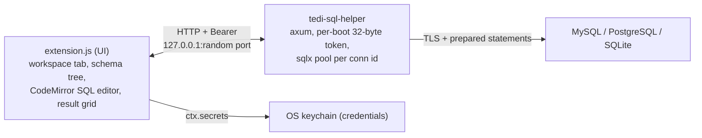

# TEDI SQL Explorer

HeidiSQL-style database workbench for [TEDI](https://tedi.ilhamriski.com/):
connect to **MySQL / MariaDB**, **PostgreSQL**, or **SQLite**, browse the schema,
write multi-statement queries with syntax highlight (run only what you selected,
explain it, recall it from history), edit rows inline, inspect indexes / foreign
keys / DDL, and export results, all in a workspace tab next to your terminals.

<p align="center">
  
</p>

> [!NOTE]
> Requires TEDI >= 0.3.37 (see `engines.tedi` in manifest.json, the
> authoritative value) for the `ctx.sidebar`, `ctx.tabs.openExtensionTab` /
> `openExtensionPane`, and `ctx.ui.codeEditor` host APIs the workbench uses.

---

## Install

1. Open **Settings → Extensions** in TEDI.
2. Switch to the **From GitHub** tab.
3. Paste `IlhamriSKY/TEDI.sql-explorer` and click **Review → Install**.

Open a connection from the **Databases** section in the left sidebar, or press
`Mod+Alt+D`, to open the workbench.

## Update

In **Settings → Extensions**, click **Check updates** on this extension's
card. If a new release exists, click **Update** to reinstall in place.

## How it works



On open:

1. Extension spawns the sidecar via `shell_bg_spawn_direct`.
2. Sidecar prints `READY {port,token}`; the extension reads via `shell_bg_logs`
   and authenticates every request with the token.
3. CRUD goes through prepared statements:
   - **UI:** insert dialog, double-click cell to edit, row delete, plus the
     tree's right-click truncate / drop.
   - **Query editor:** free-form multi-statement, gated on the per-connection
     `allow_writes` flag. A batch is pinned to ONE pooled connection, so an
     explicit `BEGIN` / `COMMIT` behaves; the session's database (MySQL `USE`)
     and schema (PostgreSQL `search_path`) are set per batch and reset rather
     than inherited from whatever ran on that connection before.
   - **PostgreSQL binds one database per connection**, so browsing a database
     the connection is not attached to opens (and caches) a pool for it. The
     base pool's catalog would otherwise answer for the wrong database.
   - Results **stream** up to the row cap instead of being fetched whole and
     truncated, and **Stop** issues a real server-side cancel (`KILL QUERY` /
     `pg_cancel_backend`), not just a dropped socket.
4. Passwords live in the OS keychain; never persisted to JSON.
5. Identifiers (db / schema / table / column) pass a strict
   `^[A-Za-z_][A-Za-z0-9_]*$` allow-list before being inlined.

## Permissions

| Permission | Why |
| --- | --- |
| `panels:register` | Mount the workbench renderer as a pane. |
| `sidebar:write` | The "Databases" connection + schema tree in the left sidebar. |
| `tabs:open` | Open / focus the workbench pane. |
| `ui:toast` | Connect / save / export result toasts. |
| `settings:read` / `settings:write` | Persist saved connections (sans password). |
| `secrets:read` / `secrets:write` | Read / write passwords in the OS keychain. |
| `ssh:connections` | Tunnel to a database behind a bastion, over an SSH connection you already saved. Only the connection **id** crosses this boundary; the SSH key / password stay in the keychain and are read by the app, never by this extension. |
| `invoke:shell_bg_spawn_direct` / `invoke:shell_bg_logs` / `invoke:shell_bg_kill` | Spawn, poll, and stop the sidecar. |

No filesystem permissions. The sidecar binds `127.0.0.1` only and authenticates
every call with the per-boot bearer token; no other machine on the LAN can reach
it.

## Development

### Source layout

The extension UI is written as small, single-responsibility ES modules under
`src/` and **bundled** into the single `extension.js` that TEDI loads (the host
reads only `manifest.main` and imports it as one module, so the shipped extension
must be a single file). `extension.js` is generated, so **edit `src/`, not
`extension.js`**. It is **not committed**: CI
([`release.yml`](.github/workflows/release.yml)) builds it from `src/` into the
release `.zip` that users install. For local dev, run `npm run build` once (or
`npm run watch` while editing) to materialise it.

> **Why ~7k lines across many small files (not one big one)?** That is the
> feature surface of a real workbench: three engines, schema tree with a
> per-node menu, query editor with run-selection / explain / history, result +
> browse grids, inline edit, insert/delete, structure with indexes + foreign
> keys + DDL, export, SSH tunnelling, connection + secrets management. The code
> is split so **no single file is a "god module"**: one file per job, and the
> largest is `dom/datePicker.js` at ~320 lines because it is one cohesive
> widget. Everything else is under 300, most well under 200. You read the one
> file for the thing you're changing, not the whole bundle. Folders group a
> feature; a `<feature>.js` **barrel** re-exports its submodules so importers
> just `import { … } from "./grid.js"` and never care that it's a folder
> underneath. Nothing is exported that only its own file uses.

**Where to start:** `index.js` (activate/wiring) → `tree/` (the sidebar you
click) → `render/` (the pane layout) → `query/` + `grid/` (results). Adding a
database engine? It is one file in `dialects/` (see below), nothing else.

#### Top-level modules (single files)

| Module | Responsibility |
| --- | --- |
| `index.js` | `activate` / `deactivate` + wiring. |
| `runtime.js` | Shared state singletons (`ctx`, `panelRoot`, …) + app constants + setters. |
| `sidecar.js` | Spawn / handshake / auto-respawn the native helper; `fetchJson`. |
| `columns.js` | Column-type classification + `/columns` metadata fetch. |
| `sql.js` | Identifier quoting + `SELECT/INSERT/UPDATE/DELETE` (display) builders. |
| `dialogs.js` | Centered / confirm modals + read-only SQL preview. |
| `export.js` | CSV / JSON / SQL export dialog. |

The rest are **feature folders**, each fronted by a same-named barrel
(`connections.js`, `dialects/index.js` is its own barrel, `dom.js`, `grid.js`,
`gridedit.js`, `query.js`, `render.js`, `styles.js`, `tree.js`):

#### `dialects/`: per-engine differences live here, nowhere else

One **data descriptor per engine**, so supporting a new database is a one-file
change (add `dialects/<engine>.js`, list it in `dialects/index.js` → `DIALECTS`).

| File | Responsibility |
| --- | --- |
| `index.js` | Registry: `getDialect(kind)`, `listDialects()`, `quoteIdent`, `buildConnectionUrl`, `sslParam`. |
| `mysql.js` / `postgres.js` / `sqlite.js` | The descriptors (label, port, url scheme, quote char, TLS map, keywords). |
| `generic.js` | Fallback descriptor for an unknown kind. |
| `sqlWords.js` | Engine-neutral SQL keyword / function / type lists for autocomplete. |
| `types.js` | JSDoc `Dialect` contract (no runtime code). |

#### `dom/`: the DOM toolkit (barrel: `dom.js`)

| File | Responsibility |
| --- | --- |
| `element.js` | `el` hyperscript + `clearChildren`. |
| `dateParts.js` | Pure date/time <-> string conversions (no DOM; unit-checked). |
| `icon.js` | `appendIcon` (HugeIcon mount). |
| `feedback.js` | `safeToast`, `copyToClipboard`, `cellText`. |
| `tooltip.js` | The delegated tooltip layer + `setTooltipAttr`. |
| `inputs.js` | `input`, `numberInput`, `checkbox`, `makeSearchInput`, `cryptoId`. |
| `menus.js` | Custom `select` dropdown, right-click `openContextMenu`, and the shared `placeFloating` viewport clamp every popup uses. |
| `datePicker.js` | The themed date / time / datetime picker widget. |
| `button.js` | `textBtn`. |

#### `grid/`: results rendering (barrel: `grid.js`)

| File | Responsibility |
| --- | --- |
| `cells.js` | Cell display, tooltip + the right-click copy menu (shared by both grids). |
| `resultGrid.js` | Read-only, client-paged free-form query results. |
| `tableGrid.js` | Editable table-browse grid: load, sort, search, paging. |

#### `gridedit/`: the write paths (barrel: `gridedit.js`)

| File | Responsibility |
| --- | --- |
| `typedEditor.js` | The shared typed inline-edit widget (`mountTypedEditor`). |
| `cellEdit.js` | Inline single-cell UPDATE (one `editCell` core, two thin entry points). |
| `rowOps.js` | Row insert / delete. |
| `structure.js` | The read-only Structure view: columns / indexes / foreign keys / DDL. |

#### `connections/`: saved connections (barrel: `connections.js`)

| File | Responsibility |
| --- | --- |
| `store.js` | Persist connections (settings), passwords (keychain), session bootstrap. |
| `lifecycle.js` | Connect / test / save / delete + connect-with-retry + select. |
| `dialog.js` | The New/Edit connection modal. |
| `tunnel.js` | SSH port forward for a database behind a bastion (`ctx.ssh`). |

#### `tree/`: the host-sidebar "Databases" tree (barrel: `tree.js`)

| File | Responsibility |
| --- | --- |
| `data.js` | Node-id encoding, lazy-tree state sets, sidecar fetchers. |
| `connState.js` | Per-connection lifecycle status + sidebar row tone. |
| `items.js` | Build the sidebar rows (`buildTreeItems`, `rowActionBtn`). |
| `view.js` | Publish the section + clicks/toggles + open workbench. |
| `menu.js` | The per-node right-click menu (refresh one node, copy name, SELECT skeleton, structure, truncate / drop). |

#### `query/`: run + render query results (barrel: `query.js`)

| File | Responsibility |
| --- | --- |
| `run.js` | `runActiveQuery` (selection-aware, `{ explain }`) / `cancelActiveQuery`. |
| `results.js` | Render a `/query` response (single or multi-statement). |
| `editContext.js` | Decide if a result is inline-editable (`resolveQueryEditContext`). |
| `sqlRefs.js` | Parse table refs + the single-table-SELECT test. |
| `history.js` | Per-connection query history + the History dialog. |

#### `render/`: the pane shell + layout (barrel: `render.js`)

| File | Responsibility |
| --- | --- |
| `panel.js` | Pane shell + the editor/results layout + splitter. |
| `actionSql.js` | The middle action-SQL strip (`setActionSql`). |
| `completions.js` | Query-editor autocomplete source. |
| `tabState.js` | Pane title + lifecycle tone (`setTabState`). |

#### `styles/`: the stylesheet, split by area (barrel: `styles.js`)

| File | Responsibility |
| --- | --- |
| `layout.js` | Shell, toolbar, editor + splitter, result scaffolding. |
| `grid.js` | Result/table grids, typed cell editors, pager. |
| `controls.js` | Dialogs, forms, select/context menus, tooltip, responsive. |

> The `styles/` chunks are concatenated **in order** by `styles.js`, so the
> cascade is byte-for-byte identical to the old single stylesheet.

#### `sidecar-src/src/`: the native helper

One job per module, same rule as the frontend.

| File | Responsibility |
| --- | --- |
| `main.rs` | Process bootstrap: token, listener, READY line, shutdown. |
| `routes.rs` | The axum router + one thin handler per endpoint. |
| `db.rs` | Driver enum, pool construction, connection-url rewriting. |
| `state.rs` | Live connections, per-database pools (`backend_for`), in-flight requests. |
| `schema.rs` | Catalog introspection: databases / schemas / tables / columns + identifier quoting. |
| `meta.rs` | Indexes, foreign keys, and `CREATE TABLE` DDL. |
| `sqltext.rs` | Statement splitting / classification / the read-only gate. Pure text, and the module's tests are the point of it. |
| `query.rs` | Running a statement batch on one pinned connection: streaming, timeouts, cancel. |
| `rows.rs` | `/table-rows`: the paged, sorted, filtered browse SELECT. |
| `edit.rs` | Row INSERT / UPDATE / DELETE by primary key. |
| `bind.rs` | JSON value → bound parameter, plus the casts PostgreSQL needs for composites and NULLs. |
| `value.rs` | Decoding a result cell of any column type back to JSON. |
| `export.rs` | CSV / JSON / INSERT-SQL rendering. |
| `auth.rs` / `error.rs` | Bearer-token middleware; the shared error → HTTP mapping. |

### Build

```bash
git clone https://github.com/IlhamriSKY/TEDI.sql-explorer.git
cd TEDI.sql-explorer

# Build extension.js from src/ (generated by esbuild, not committed).
npm install
npm run build          # one-shot: src/ → extension.js
npm run watch          # rebuild on save during development

# Build the native sidecar for your host.
cd sidecar-src
cargo build --release
mkdir -p ../sidecar/<platform>-<arch>      # e.g. windows-x86_64
cp target/release/tedi-sql-helper* ../sidecar/<platform>-<arch>/
cd ..

# Package, then install via Settings → Extensions → From file. Build first so
# the zip carries the BUILT extension.js (it is not committed):
npm run build
zip -r dev.zip manifest.json extension.js logo.png README.md CHANGELOG.md LICENSE sidecar
```

> When developing against a TEDI checkout that dev-links this folder
> (`pnpm tauri:dev:ext`), run `npm run watch` here so `extension.js` rebuilds on
> every edit, then reload the TEDI window (Ctrl+R).

To cut a release, tag `vX.Y.Z` and push. CI in
[`.github/workflows/release.yml`](.github/workflows/release.yml) builds
`extension.js` from `src/` **and** the sidecar for every supported platform,
packages them into the `.zip`, and uploads it to the GitHub release (which TEDI's
installer reads from `releases/latest`). No PAT needed: the release job uses the
workflow's built-in `GITHUB_TOKEN`.
